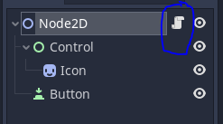
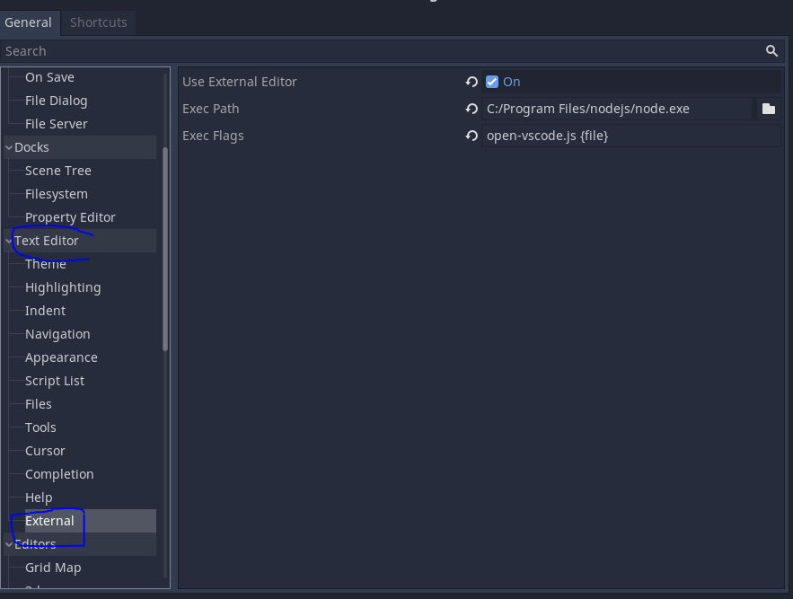

# Godot Typescript Testing (GoTT) 👼=👾⌨📃🧪

This is a simple testing project to use the [Godot Engine](https://github.com/godotengine/godot) and [ECMAScript](https://github.com/Geequlim/ECMAScript).

## Requirements

1. Download and install [nodejs](https://nodejs.org/de)
2. Download the [Godot Editor with ECMAScript](https://github.com/Geequlim/ECMAScript/releases)
3. Unpack the editor file and rename it to `godot`/`godot.exe`/`godot.mono` based on your OS
4. Put it to your path variables to access it from a terminal
5. Test the requirements by running `godot --version` and `npm --version` in a new terminal

## Getting started

1. Run `npm i` to download all dependencies
2. Run `npm run dev` to start compling `ts` and opening the godot editor
3. Press the play button in the editor or run `npm run start` to start the game
4. You should see the current time coming from npm package [dayjs](https://day.js.org/)

## Open scripts from the editor

Inside the editor you are normally able to open a script inside the build in IDE.

But we use a compiled `.jsx` file for our scripts.
`.tsx` files can't be open in the editor.

So we need a workaround for this issue:

1. Goto `Editor/Editor Settings/Text Editor/External`
2. Check the `Use External Editor`
3. Add your installation path for `nodejs` to `Exec Path`
4. Paste `open.js -f {file}` to `Exec Flags`

When you open a script from `scripts/generated/*.jsx` you should be redirected to VSCode and the original `.tsx` file should be open.

If you like to open the file in intellij use `open.js -i idea -f {file}`
